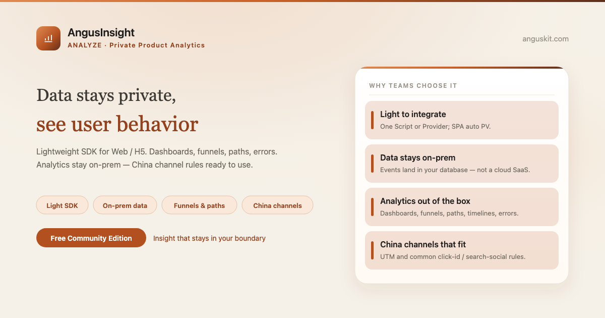
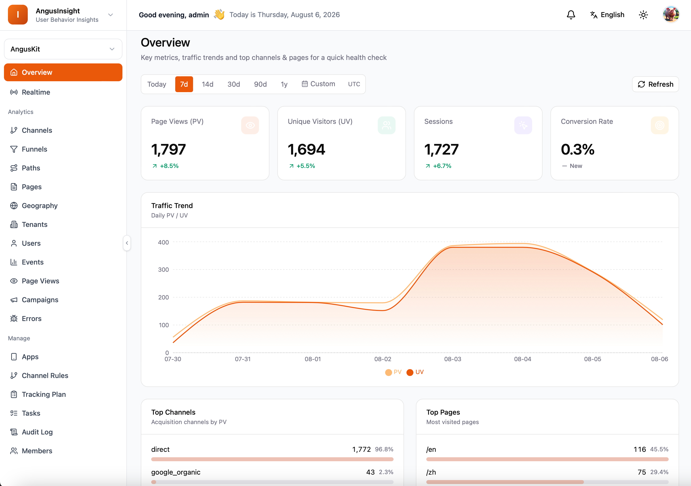

**English** | [简体中文](README.zh.md)

<p align="center">
  
</p>

<p align="center">
  <a href="https://www.anguskit.com/en/pricing"></a>
  <a href="LICENSE"></a>
  <a href="https://www.anguskit.com/en/docs/insight"></a>
  <a href="https://www.anguskit.com"></a>
</p>

# AngusInsight

**Know Your Users, Grow Your Product. Private Analytics, Zero Compromise.**

Private Product Analytics — the Analyze product in [AngusKit](https://github.com/AngusKit/AngusKit).

> **This repository hosts documentation only.** AngusInsight source code is distributed through private deployment packages, not through this GitHub repository. Earlier revisions of this repository contained application source; as of this update, distribution has moved to AngusKit's packaging pipeline (see [Get the Community Edition](#get-the-community-edition-free) below). This repository now focuses on product information, quickstart guides, and links to the full documentation site.

## What is AngusInsight

AngusInsight is lightweight user-behavior analytics for enterprise and internal products, built to run entirely on infrastructure you control. Events land in your own database — dashboards, funnels, and error monitoring run on-prem, turning real post-release usage into insight without shipping behavior data to a public cloud.

<sub>AngusInsight is private-deployment only — it is not offered as a hosted SaaS.</sub>

## Key capabilities

- **Lightweight SDK** — fast Web/H5 install with PV, custom events, conversions, and `identify` out of the box; automatic SPA capture
- **Dashboard & realtime** — PV/UV/session overview and trends, plus a realtime window for online users and event streams
- **China channel rules** — UTM, referrer, and common click-ID rules assign channel codes; compare campaigns by campaign ID
- **Conversion funnels** — multi-step ordered event funnels with per-step pass rates and drop-off highlights
- **Paths & user timeline** — in-session page-path Sankey diagrams and single-user event-sequence reconstruction
- **Errors in the same stack** — JS, resource, and API errors captured and grouped alongside behavior data

## Screenshot

<p align="center">
  
</p>

## Get the Community Edition (free)

```bash
curl -LO https://repo.anguskit.com/raw/raw-public/AngusKit/insight/AngusInsight-Community-1.0.0.zip
unzip AngusInsight-Community-1.0.0.zip
cd AngusInsight-1.0.0/docker
cp env.example .env
docker compose --profile mysql up -d
```

- Minimum: **2 cores / 4 GB** (recommended: 4 cores / 8 GB, more as event volume grows); disk 40 GB, more as events accumulate
- Ports after install: AngusGM `8801` (sign-in), AngusInsight `8808`
- Configure the SDK collect endpoint only after you create an app and obtain an appCode/appKey
- Only need AngusInsight? This zip includes AngusInsight + AngusGM — no other product required.

Full installation guide (host ZIP, Kubernetes/Helm, TLS, upgrades, SDK tracking plan): **[docs.anguskit.com/insight](https://www.anguskit.com/en/docs/insight/latest/en/manual/02-install-deploy)**

## Community vs. Team / Enterprise

| | Community | Team / Enterprise |
|---|---|---|
| Price | Free | Paid, private deployment |
| Users | Up to 10 | Higher / unlimited seats |
| Apps | Up to 5 | Higher / unlimited |
| Data retention | 30 days | Longer / configurable |
| Funnels, path analysis, advanced error rules, MCP | Not included | Included |
| Delivery model | Private deployment only | Private deployment only |

Community Edition source is licensed under GPL-3.0 and distributed with each Community installation package. Team and Enterprise editions are proprietary, governed by the **XCan Business License, Version 1.0**, distributed only under a paid subscription.

Full pricing and feature comparison: **[anguskit.com/pricing](https://www.anguskit.com/en/pricing)**

## Related AngusKit products

| Product | Focus | Repository |
|---|---|---|
| AngusKit | The full suite (this product + 5 others + AngusGM) | [AngusKit/AngusKit](https://github.com/AngusKit/AngusKit) |
| AngusAI | AI agent development | [AngusKit/AngusAI](https://github.com/AngusKit/AngusAI) |
| AngusGit | AI-native code collaboration | [AngusKit/AngusGit](https://github.com/AngusKit/AngusGit) |
| AngusRepo | Universal artifact management | [AngusKit/AngusRepo](https://github.com/AngusKit/AngusRepo) |
| AngusTester | AI-native software testing | [AngusKit/AngusTester](https://github.com/AngusKit/AngusTester) |
| AngusSecurity | Application security & governance | [AngusKit/AngusSecurity](https://github.com/AngusKit/AngusSecurity) |

## Documentation & support

- Full docs: [anguskit.com/docs/insight](https://www.anguskit.com/en/docs/insight)
- Contact / sales: [anguskit.com/contact](https://www.anguskit.com/en/contact) · `sales@anguskit.com`
- This repository's Issues are for **documentation feedback and install troubleshooting**. This repository does not accept source code pull requests — see [CONTRIBUTING.md](CONTRIBUTING.md).

## License

- This repository's documentation content: see [LICENSE](LICENSE) (GPL-3.0, matching the Community Edition source it describes).
- AngusInsight Community Edition product source: GPL-3.0, distributed with each Community installation package.
- AngusInsight Team / Enterprise Edition: proprietary, XCan Business License v1.0, distributed under a paid subscription only.
