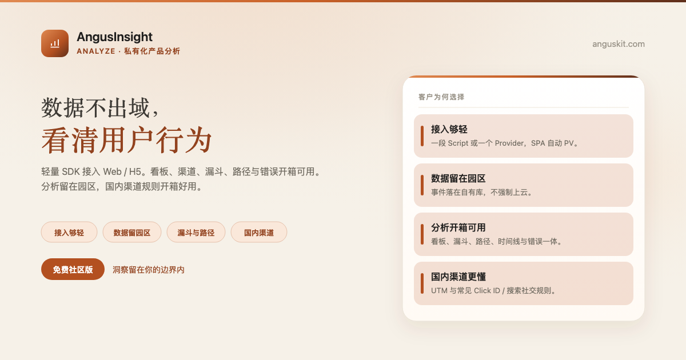
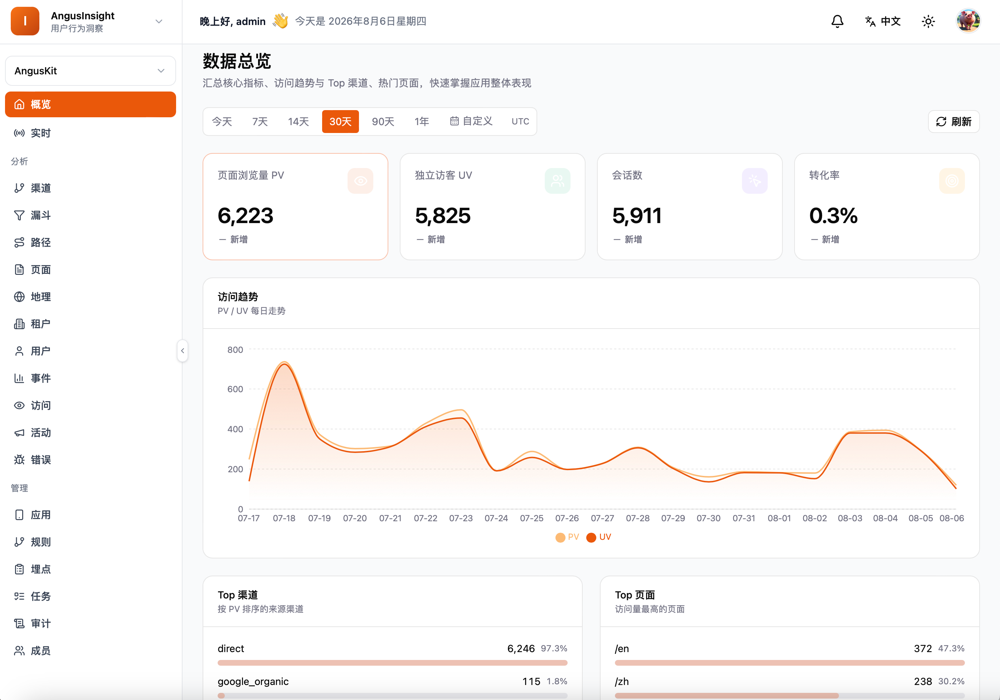

[English](README.md) | **简体中文**

<p align="center">
  
</p>

<p align="center">
  <a href="https://www.anguskit.com/zh/pricing"></a>
  <a href="LICENSE"></a>
  <a href="https://www.anguskit.com/zh/docs/insight"></a>
  <a href="https://www.anguskit.com"></a>
</p>

# AngusInsight

**懂你的用户，才能增长你的产品：私有化分析，零妥协。**

私有化产品分析——[AngusKit](https://github.com/AngusKit/AngusKit) 中负责 Analyze 的产品。

> **本仓库仅承载文档内容。** AngusInsight 的产品源码通过私有化安装包分发，不在本 GitHub 仓库公开。本仓库此前版本曾包含应用源码；本次更新后，源码分发已统一收拢到 AngusKit 的打包发布流水线（见下文「免费获取社区版」）。本仓库现聚焦于产品信息、快速上手指引，以及指向完整文档站的链接。

## AngusInsight 是什么

AngusInsight 是面向企业与中后台产品的轻量用户行为分析，完全跑在你自己的基础设施上。事件落在自有数据库，看板、漏斗与错误监控全部在本地完成，把上线之后的真实使用情况变成可读洞察，不需要把行为数据发到公有云。

<sub>AngusInsight 仅提供私有化部署，不作为托管 SaaS 提供。</sub>

## 核心能力

- **轻量 SDK**——快速接入 Web/H5，PV、自定义事件、转化与 `identify` 开箱即用，SPA 自动采集
- **看板与实时**——PV/UV/会话总览与趋势，实时窗口看在线用户与事件流
- **国内渠道规则**——UTM、referrer 与常见 Click ID 规则打渠道码，按活动 ID 对比复盘
- **转化漏斗**——多步骤有序事件漏斗，各步骤通过率与卡点一目了然
- **路径与用户时间线**——会话内页面路径桑基图，还原单用户事件序列
- **错误监控一体**——JS、资源与接口错误采集分组，与行为数据同台呈现

## 产品截图

<p align="center">
  
</p>

## 免费获取社区版

```bash
curl -LO https://repo.anguskit.com/raw/raw-public/AngusKit/insight/AngusInsight-Community-1.0.0.zip
unzip AngusInsight-Community-1.0.0.zip
cd AngusInsight-1.0.0/docker
cp env.example .env
docker compose --profile mysql up -d
```

- 最低配置：**2 核/4 GB**（推荐 4 核/8 GB，事件量大时可上调）；磁盘 40 GB，随事件量增长
- 安装完成后端口：AngusGM `8801`（登录入口）、AngusInsight `8808`
- 创建应用并获取 appCode/appKey 后再配置 SDK 采集端点
- 只需要 AngusInsight？这份 zip 已包含 AngusInsight + AngusGM，无需其它产品。

完整安装指南（主机 ZIP、Kubernetes/Helm、TLS、升级、SDK 埋点方案）：**[docs.anguskit.com/insight](https://www.anguskit.com/zh/docs/insight/latest/zh/manual/02-install-deploy)**

## 社区版 vs 团队版/企业版

| | 社区版 | 团队版/企业版 |
|---|---|---|
| 价格 | 免费 | 付费，私有化部署 |
| 用户数 | 最多 10 | 更高/不限席位 |
| 应用数 | 最多 5 | 更高/不限 |
| 数据保留 | 30 天 | 更长/可配置 |
| 漏斗、路径分析、高级错误规则、MCP | 不含 | 包含 |
| 交付形态 | 仅私有化部署 | 仅私有化部署 |

社区版源码使用 GPL-3.0 协议，随社区版安装包一同分发。团队版与企业版为专有软件，受 **XCan Business License, Version 1.0** 约束，仅随付费订阅提供。

完整定价与功能对照：**[anguskit.com/pricing](https://www.anguskit.com/zh/pricing)**

## AngusKit 关联产品

| 产品 | 定位 | 仓库 |
|---|---|---|
| AngusKit | 完整套件（本产品 + 其它 5 个 + AngusGM） | [AngusKit/AngusKit](https://github.com/AngusKit/AngusKit) |
| AngusAI | AI 智能体开发 | [AngusKit/AngusAI](https://github.com/AngusKit/AngusAI) |
| AngusGit | AI 原生代码协作 | [AngusKit/AngusGit](https://github.com/AngusKit/AngusGit) |
| AngusRepo | 通用制品管理 | [AngusKit/AngusRepo](https://github.com/AngusKit/AngusRepo) |
| AngusTester | AI 原生软件测试 | [AngusKit/AngusTester](https://github.com/AngusKit/AngusTester) |
| AngusSecurity | 应用安全与治理 | [AngusKit/AngusSecurity](https://github.com/AngusKit/AngusSecurity) |

## 文档与支持

- 完整文档：[anguskit.com/docs/insight](https://www.anguskit.com/zh/docs/insight)
- 联系/销售：[anguskit.com/contact](https://www.anguskit.com/zh/contact) · `sales@anguskit.com`
- 本仓库的 Issues 仅用于**文档反馈与安装排查**。本仓库不接受源码 Pull Request，详见 [CONTRIBUTING.md](CONTRIBUTING.md)。

## License

- 本仓库文档内容：见 [LICENSE](LICENSE)（GPL-3.0，与其描述的社区版源码保持一致）。
- AngusInsight 社区版产品源码：GPL-3.0，随每个社区版安装包分发。
- AngusInsight 团队版/企业版：专有软件，XCan Business License v1.0，仅随付费订阅提供。
